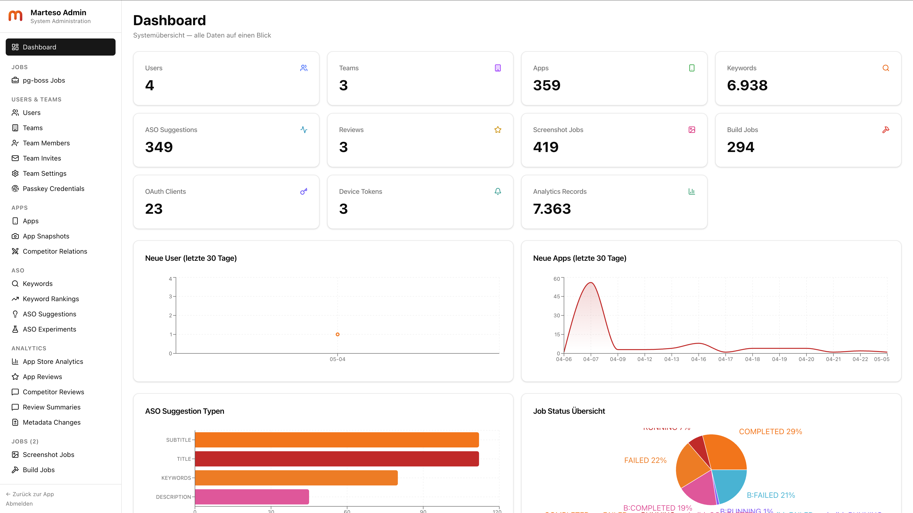
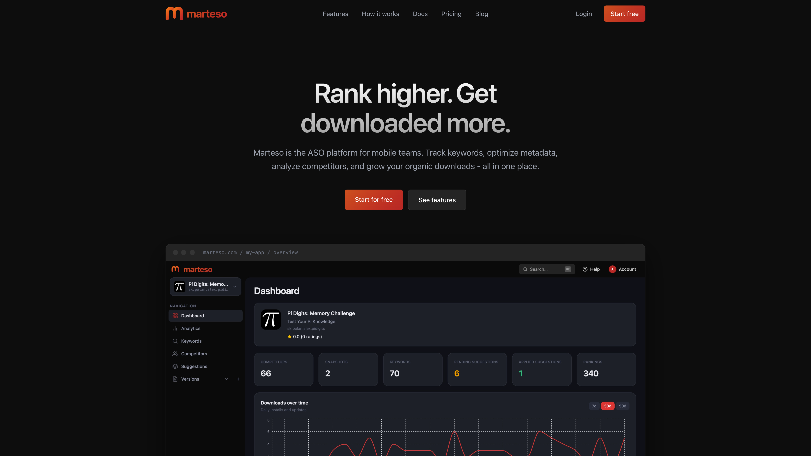
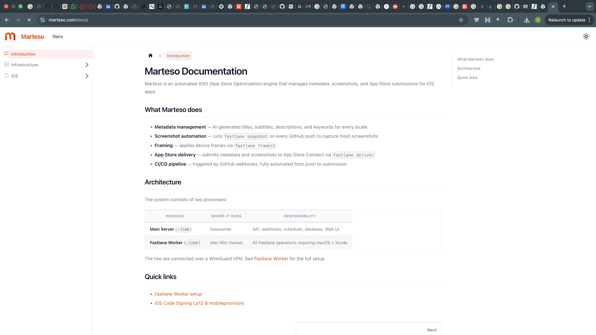

<h1>
  
  Marteso
</h1>

Marteso is a platform which combines iOS CI&CD pipeline with ASO tools. The core is the screenshot pipeline which automatically generates screenshots and valid signed binaries on every GitHub push, basically like Vercel but for iOS apps.

Important Features:
- Analytics: Shows Impressions, Page Views and Dwonloads by country and date
- Keywords: Tracks your App ranking and discovers new keywords with Ai based on competitors text, category etc.
- Competitors: Tracks your App competitors and gathers intel about them:
	- Summarized Reviews
	- Tracking of Metadata changes
- Suggestions: Suggests better metadata based on tracked keywords and competitors (doesb't work that great yet)
- Monetization: Manages Subscriptios and One time purchases (one time pruchases not implemented yet)
- Versions: Metdata managament with auto translate feature
- More/Gamecenter: Management of game center related stuff like leaderbaords, achievements and challenges (experiment)
- Team: Marteso supports Teams although roles arent fully implemented yet, but you can already invite other users
- MCP Agents support

Secondary/Specific Features:
Passkeys
Autonomous mode (planned)

## Demo

App: [marteso.com](https://marteso.com)

## Screenshots

| Admin                                     | Landing                                       | Main App                                        |
| ----------------------------------------- | --------------------------------------------- | ----------------------------------------------- |
| <!--  --> | <!--  --> | <!--  --> |

| Worker                                      | Docs                                    | iOS App                                       |
| ------------------------------------------- | --------------------------------------- | --------------------------------------------- |
| <!--  --> | <!--  --> | <!--  --> |

## 6 parts

### Admin

React + Shadcn

link: `/admin`

### Docs

Technology: Docosaurus

link: `/docs`

### Landing

Technology: Astro

link: `/`

### Main App

Technology: Reac (frontend), TypeScript (backend)

link: `/app`

### Worker

Technology: TypeScript - manages ios stuff which needs MacOs/Xcode

#### important

- Setup DHCP lease
- Disable mac minis 1 minute auto sleep
- Should be on smae network (security) although there is a secret for communication
- recommended: Atleast 16gb of ram - ImageMagic and iOS simulators need a lot of Ram and should be latest Version of MacOs

### iOS App

Technology: Swift - Not upodate atm - mostly used for push notifications

## AI transparency

I used AI mainly for debugging Xcode-related code around the screenshots pipeline, and also for parts of the landing page. I also used it for the MCP server, since recreating all web API endpoints again in a different format for the AI is mostly just repetitive busywork.
Docs - I had no tie to write proper docs yet
iOS app

## Credits

- Main App's Design partly inspired by RevenueCat
- Landing page design partly inspired by Linear and Vercel
- Using Fastlane and Frameit for Screenshot pipeline
