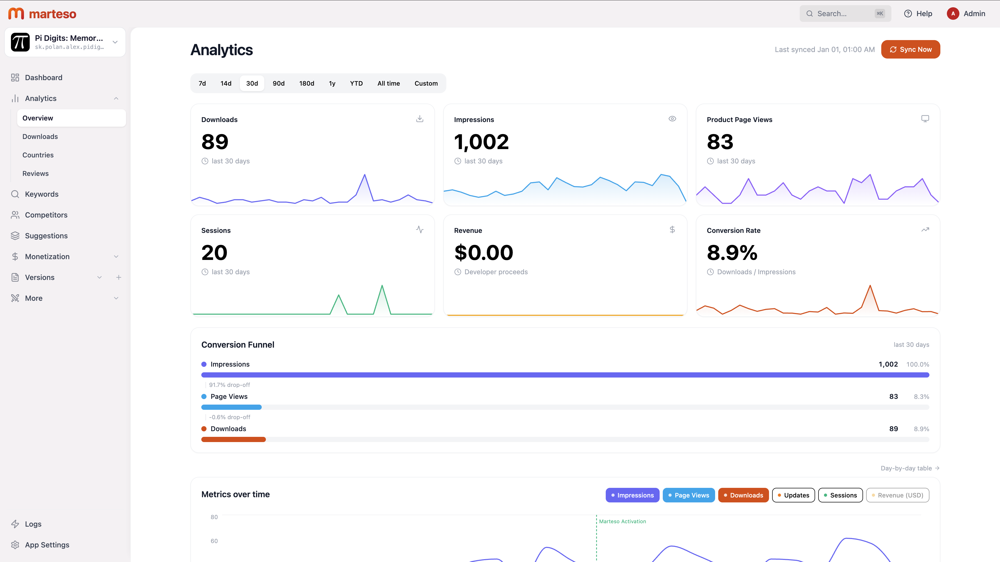

<h1>
  
  Marteso
</h1>

Marteso is a platform which combines iOS CI&CD pipeline with ASO tools. The core is the screenshot pipeline which automatically generates screenshots and valid signed binaries on every GitHub push, basically like Vercel but for iOS apps. Marteso is still WIP.

## Demo

App: [app.marteso.com](https://app.marteso.com)

Demo Credentials:

- Email: `demo@marteso.com`
- Password: `demo1234`

There are 3 apps:

- Pi Digits has the most analytics data to showcase
- RowTally showcases the subscription page
- CalcBlitz showcases Versions because of many localizations

Note: If you're getting error 500 or 429 there is unfortunately nothing I can do since Apple's rate limiting is very aggressive.

## What's new from my HCTG submission (starting 05/06/2026)

Last HCTG commit: Update README.md (1ef1c6af17489883f9d05bed8ea7d4ddc08f76ac)

**Auth, onboarding & signup**

- Added Google OAuth and GitHub login as alternatives to email/password
- Split sign up into its own page and redesigned the onboarding flow to reduce friction (skip passkeys on signup, only show onboarding to new users)
- Added a quick ASO check step to onboarding so new users see value immediately
- Switched auth tokens from localStorage to httpOnly cookies and hardened JWT + token revocation
- Added a demo access mode with a dedicated middleware so reviewers can poke around without signing up
- New Security page in settings (password change, passkeys) and personalized welcome email on signup

**Permissions & roles**

- Introduced `appAccess`, `bundleAccess` and `loadTeamSettings` middlewares and ported `apps.ts` / `keywords.ts` / `asc.ts` / `team.ts` over to them; team-id checks now live in `requireAuth`
- Wired role checks through both backend and the Versions frontend
- Fixed several security issues in `asc.ts` and `team.ts` uncovered while refactoring

**ASC pipeline — replacing Fastlane**

- Replaced Fastlane `deliver` for screenshot, metadata and binary uploads with custom App Store Connect upload logic
- IPAs are now uploaded via the macOS worker through Transporter instead of Fastlane
- Added a "Push Binary" action with auto version increment
- All ASC traffic is now routed through the DO server; ASC rate limits are logged, tracked in the DB and surfaced in the admin panel
- Optimized the ASC client and `FastlaneService` to make significantly fewer API calls

**Screenshot pipeline**

- Added Capacitor app support and auto-detection of the app framework (with an icon in the framework selector)
- Allowed nested subdirectories when locating the iOS app
- Added timeout + retry logic to the snapshot runner, fixed OOM crashes and a broken pipeline regression
- Auto-generate screenshot thumbnails for faster dashboard loads
- Improved font selection for non-latin alphabet languages in frameit

**ASO & AI quality**

- Improved Quick Scan output quality with AI (+ temperature fix for GPT-5.5)
- New keyword coverage view in Keywords
- Removed per-team AI API keys — Marteso now uses its own keys
- Fixed App Store scraper returning empty subtitle and no screenshots
- Fixed metadata push failing for apps with many localizations

**Monetization**

- Added in-app products (one-time purchases) support
- Added a billing page in settings (not production-ready yet)

**Analytics**

- Set up PostHog with additional product events
- Optimized analytics sync

**Admin panel**

- Display names instead of raw IDs, with linked navigation between users → teams → settings etc.

**Performance**

- Added Prisma indexes that cut dashboard load time by ~10s
- Frontend now only loads the user's own apps
- Added a progress bar to Versions, fixed stale version showing after app switch and a CLS issue

**Infra & housekeeping**

- Migrated domain from `marteso.com` to `app.marteso.com` and removed the `/app/` prefix
- Outsourced landing page and docs into their own repos
- Added favicon

## Screenshots

| Admin                            | Landing                              |
| -------------------------------- | ------------------------------------ |
|  |  |

| Main App                          | Docs                           |
| --------------------------------- | ------------------------------ |
|  |  |

## Important Features

- Analytics: Shows Impressions, Page Views and Downloads by country and date
- Keywords: Tracks your App ranking and discovers new keywords with AI based on competitors text, category etc.
- Competitors: Tracks your App competitors and gathers intel about them:
  - Summarized Reviews
  - Tracking of Metadata changes
- Suggestions: Suggests better metadata based on tracked keywords and competitors (doesn't work that great yet)
- Monetization: Manages Subscriptions and One-time purchases (one-time purchases not implemented yet)
- Versions: Metadata management with auto-translate feature
- More/Game Center: Management of Game Center related stuff like leaderboards, achievements and challenges (experiment)
- Team: Marteso supports Teams although roles aren't fully implemented yet, but you can already invite other users
- MCP Agents support

## Secondary/Specific Features

- Passkeys
- Autonomous mode (planned)
- admin panel
- iOS app for notifications

## Architecture

Marteso consists of a main server, web dashboard, admin panel, landing page, docs site, macOS Fastlane worker, and an optional iOS companion app.

- Main Server: Express API, Prisma/Postgres, pg-boss jobs, MCP server
- Web App: Main user dashboard at `/app`
- Admin: Internal admin panel at `/admin`
- Landing: Public website at `/`
- Docs: Docusaurus docs at `/docs`
- Worker: macOS-only Fastlane/Xcode worker for screenshots, frameit, deliver and IPA builds
- iOS App: Companion app for push notifications

## Prerequisites

- Node.js 22+
- PostgreSQL
- macOS + Xcode for Worker/iOS screenshot features
- Fastlane for Worker features
- Apple Developer account for App Store Connect features

## Local Development

```bash
npm install
npm install --prefix web
npm install --prefix admin
npm install --prefix landing
npm install --prefix docs
cp .env.example .env
npm run db:generate
npm run db:migrate
npm run dev
```

Main server runs on `http://localhost:3100`.

Frontend dev servers:

- Landing: `http://localhost:4321`
- Web App: `http://localhost:5173/app`
- Admin: `http://localhost:5174/admin`

The root `npm run dev` starts the main server, web app and admin panel. Landing and docs can be started separately:

```bash
cd landing && npm run dev
cd docs && npm start -- --port 3030
```

## Development URLs

- Main server: `http://localhost:3100`
- Landing: `http://localhost:4321`
- Web App: `http://localhost:5173/app`
- Admin: `http://localhost:5174/admin`
- Docs: `http://localhost:3030/docs`
- Worker: `http://localhost:3200`

## Environment

Required:

- `DATABASE_URL`
- `JWT_SECRET`
- `ENCRYPTION_KEY` for encrypted team settings in production

Optional integrations:

- App Store Connect credentials
- Apple Search Ads credentials
- GitHub OAuth / webhooks
- Fastlane Worker URL + secret
- APNs credentials
- Resend email credentials

Use `.env.example` as the starting point.

## Database

Marteso uses PostgreSQL with Prisma.

```bash
npm run db:generate
npm run db:migrate
npm run db:studio
```

## Build

```bash
npm run build
npm run web:build
npm run admin:build
cd landing && npm run build
cd docs && npm run build
```

## Routes

- `/` Landing page
- `/app` Main Marteso dashboard
- `/admin` Admin panel
- `/docs` Documentation
- `/api/*` Backend API
- `/mcp` MCP endpoint

## Repository Structure

- `src/` Main server, API routes, jobs, services and MCP server
- `web/` Main React dashboard
- `admin/` Internal admin panel
- `landing/` Astro marketing site
- `docs/` Docusaurus documentation
- `worker/` macOS Fastlane worker
- `Marteso/` iOS companion app and UI tests
- `prisma/` Database schema and migrations
- `readme_files/` README assets

## 6 parts

### Admin

- React + Shadcn
- link: `/admin`

### Docs

- Technology: Docusaurus
- link: `/docs`

### Landing

- Technology: Astro
- link: `/`

### Main App

- Technology: React (frontend), TypeScript (backend)
- link: `/app`

### Worker

- Technology: TypeScript - manages iOS stuff which needs macOS/Xcode

#### important

- Setup DHCP lease
- Disable Mac Minis 1 minute auto sleep
- Should be on same network (security) although there is a secret for communication
- recommended: At least 16GB of RAM - ImageMagick and iOS simulators need a lot of RAM and should be latest version of macOS

### iOS App

- Technology: Swift - Not up to date atm - mostly used for push notifications

## Fastlane Worker

The worker runs on macOS because screenshots, simulators, Xcode builds, fastlane snapshot, frameit and deliver require Xcode/macOS.

Worker endpoints:

- `GET /health`
- `POST /worker/snapshot`
- `POST /worker/build`
- `POST /worker/frameit`
- `POST /worker/deliver`

More details: [`docs/docs/infrastructure/fastlane-worker.md`](docs/docs/infrastructure/fastlane-worker.md)

## Background Jobs

Marteso uses pg-boss for scheduled and manual jobs.

Scheduled jobs:

- keyword tracking
- analytics sync

Manual jobs (should be scheduled but because of AI costs disabled atm):

- metadata sync
- competitor intel
- localization translation
- keyword discovery / analysis experiments

## Integrations

- App Store Connect API
- GitHub OAuth and webhooks
- Fastlane
- Xcode simulators
- APNs push notifications
- OpenAI / Anthropic for AI suggestions and analysis
- Ollama (experimental)
- MCP server for AI agent access

## Security

Do not commit `.env`, Apple private keys, certificates, provisioning profiles, APNs keys or signing secrets. Production should set `JWT_SECRET` and `ENCRYPTION_KEY` explicitly.

## Known Notes

- Root `npm run dev` does not start landing/docs.
- Worker features require macOS, Xcode and simulators.
- Some App Store Connect features need valid team credentials and app access.
- Game Center and autonomous features are experimental.

## Project Status

Marteso is actively developed. Some features are experimental or incomplete:

- autonomous mode
- one-time purchases
- Game Center management
- team roles
- iOS companion app
- docs

## Hour count

Regarding the hour count: I've logged 157h on Hackatime, but 112h were already submitted to HCTG. Please approve only 45h for this. (Horizons shows 150h because the first 7h were logged before Horizons started, but those are included in the HCTG submission.)

## AI transparency

- Screenshot pipeline: AI was mainly used for debugging Xcode-related code around screenshot generation.
- Landing page: Parts of the landing page were built with AI assistance.
- MCP server: AI was used because recreating all web API endpoints again in a different format for the AI is mostly just repetitive busywork.
- Docs: All markdown docs are currently written with AI assistance because I had no time to write proper docs yet. This is subject to change in the future.
- iOS app: The iOS app was developed with strong AI assistance. Its primary goal is sending notifications.
- What's new section in the Readme.md (summary of 100+ commits)
- 60% of Admin MCP

## Credits

- Main App's Design partly inspired by RevenueCat
- Landing page design partly inspired by Linear and Vercel
- Using Fastlane and Frameit for Screenshot pipeline
